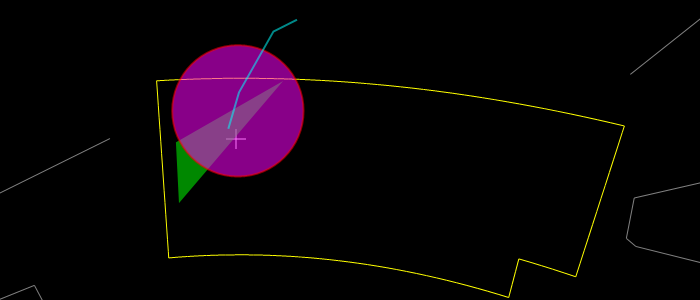

# Web Control Objects

The [*WWTControl**](#wwtcontrol-object) object is the principal object, the other objects are created on initialization of the object, or can be created by the methods provided by this object.

Note that the **Example Code** listed for each property or method is _not_ code that will run on its own, just an example of how to use the property or method within a script. Run-able samples are listed and linked to in the [Web Control Samples](#web-control-samples) section.

| Object | Description |
| :-- | :-- |
| [**Annotation**](#annotation-object) | Used to describe the annotation for a Circle, Poly or PolyLine object. |
| [**Circle**](#circle-object) | Used to render a circle on the screen. |
| [**Poly**](#poly-object) | Used to render a polygon on the screen. |
| [**PolyLine**](#polyline-object) | Used to render a polyline on the screen. |
| [**Settings**](#settings-object) | Used to specify a range of settings for a View object. |
| [**WWTControl**](#wwtcontrol-object) | Used to manage the canvas view of WorldWide Telescope images. |

## Annotation Object

The Annotation Object is inherited by the [**Circle**](#circle-object) object, the [**Poly**](#poly-object) object, and the [**PolyLine** ](#polyline-object)object, and is used to describe the annotation for these objects. An Annotation object is not used independently of these other objects, so this object should not be instantiated on its own.

| Property | Description |
| :-- | :-- |
| [**ID**](#annotation-id-property) | Contains a string for use by the web client. |
| [**Label**](#annotation-label-property) | Contains descriptive text for the annotation. |
| [**Opacity**](#annotation-opacity-property) | Specifies the opacity to be applied to the complete annotation. |
| [**ShowHoverLabel**](#annotation-showhoverlabel-property) | Specifies whether to render the label if the mouse is hovering over the annotation. |
| [**Center**](#annotation-center-property) | Specifies the center of the annotation. |
| [**Tag**](#annotation-tag-property) | Contains a string for use by the web client. |


### Annotation id property

The **ID** property contains a string for use by the web client.

#### Remarks

This string can be used to hold information (perhaps a URL or link to related information, reference string or number, credits, date, times, and so on) that is of use to the web client. The ID string is returned with a [**AnnotationClicked**](#wwtcontrol-annotationclicked-event) event.


#### Syntax

```js
Annotation.set_id([string])
[string] Annotation.get_id()
```

#### Example Code


```js
// Draw a circle at the center of the constellation Sagittarius
circle.setCenter(286.485, -27.5231666666667);
circle.set_id("Center of the Constellation Sagittarius");
```




### Annotation label property

The **Label** property contains descriptive text for the annotation.

#### Remarks

The label text will be rendered if the [**ShowHoverLabel**](#annotation-showhoverlabel-property) property is set to true.


#### Syntax
```js
Annotation.set_label([string])
[string] Annotation.get_label()
```

#### Example Code


```js
// Draw a circle at the center of the constellation Sagittarius
circle.setCenter(286.485, -27.5231666666667);
circle.set_id("Center of the Constellation Sagittarius");
circle.set_label("RA: 286.485, Dec: -27.5231666666667");
```



### Annotation opacity property

The **Opacity** property specifies the opacity to be applied to the complete annotation.

#### Remarks

The default opacity setting is 1.0, which means that no transparency blending will be applied to the complete annotation. A value of 0.5, for example, will result in a 50% transparency blending being applied. Note that the color values for individual lines and fill color (which can include an alpha transparency value) are applied to the specific lines and shapes before the opacity value here is applied to the entire annotation.


#### Syntax
```js
Annotation.set_opacity([double])
[double] Annotation.get_opacity()
```

#### Example Code


```js
// Set a solid fill color
circle.set_fillColor("red");
circle.set_fill(true);
// Apply a 50% transparency to the entire annotation
circle.set_opacity(0.5);
```



### Annotation showHoverLabel property

The **ShowHoverLabel** property specifies whether to render the label if the mouse is hovering over the annotation.

#### Remarks

The default setting is false.


#### Syntax
```js
Annotation.set_showHoverLabel([Bool])
[Bool] Annotation.get_showHoverLabel()
```
#### Example Code


```js
// Draw a circle at the center of the constellation Sagittarius
circle.setCenter(286.485, -27.5231666666667);
circle.set_id("Center of the Constellation Sagittarius");
circle.set_label("RA: 286.485, Dec: -27.5231666666667");
circle.set_showHoverLabel(true);
```



### Annotation center property

The **Center** property contains a Vector3d object for use by the web client.

#### Remarks

This Vector3d object is used to hold the center position of the annotation object used by the web client.


#### Syntax
```js
Annotation.setCenter([Vector3d])
[Vector3d] Annotation.getCenter()
```

#### Example Code


```js
var vector3d = new wwtlib.Vector3d(x, y, z);
circle.setCenter(vector3d);
```



### Annotation tag property

The **Tag** property contains a string for use by the web client.

#### Remarks

This string can be used to hold information that is of use to the web client. The string is not used internally by WorldWide Telescope.


#### Syntax
```js
Annotation.set_tag([string])
[string] Annotation.get_tag()
```

#### Example Code


```js
circle.set_tag("001");
```



## Circle Object

The Circle object is used to render a circle on the screen. It is created by the [**CreateCircle**](#wwtcontrol-createcircle-method) method.

The Circle object inherits the properties of the [**Annotation**](#annotation-object) object.



The image shows a purple circle with a 2 pixel line, a green polygon and a light blue polyline. Note that the order in which the elements are drawn is significant in how they appear, if there is any overlap or transparency.

| Property | Description |
| :-- |
| [**Fill**](#circle-fill-property) | Specifies whether the circle should be filled or not. |
| [**FillColor**](#circle-fillcolor-property) | Specifies the fill color as an ARGB value. |
| [**LineColor**](#circle-linecolor-property) | Specifies the line color as an ARGB value. |
| [**LineWidth**](#circle-linewidth-property) | Specifies the line width in pixels. |
| [**Radius**](#circle-radius-property) | Specifies the circle radius. |
| [**SkyRelative**](#circle-skyrelative-property) | Specifies whether the circle size is absolute or relative. |

| Method | Description |
| :-- |
| [**SetCenter**](#circle-setcenter-method) | Specifies the center coordinates of the circle. |



### Circle Fill property

The **Fill** property specifies whether the circle should be filled or not.

#### Remarks

The default is false.


#### Syntax
```js
Circle.set_fill([Bool])
[Bool] Circle.get_fill();
```

#### Example Code

```js
// Fill a circle with a transparent red
circle.set_fill(true);
circle.set_fillColor("0x55AA0000");
```




### Circle FillColor Property

The **FillColor** property specifies the fill color as an ARGB value.

#### Remarks

The default fill color is white. The four bytes of the unsigned integer are the alpha, red, green and blue values respectively.


#### Syntax
```js
Circle.set_fillColor([string])
[string] Circle.get_fillColor()
```

#### Example Code


```js
// Fill a circle with opaque green
circle.set_fill(true);
circle.set_fillColor("green");
```




### Circle LineColor Property

The **LineColor** property specifies the line color as an ARGB value.

#### Remarks

The default line color is white. The four bytes of the unsigned integer are the alpha, red, green and blue values respectively.


#### Syntax
```js
Circle.set_lineColor([string])
[string] Circle.get_lineColor()
```

#### Example Code


```js
// Draw a circle in opaque dark gray
circle.set_lineColor("0xFF555555");
```




### Circle LineWidth Property

The **LineWidth** property specifies the line width in pixels.

#### Remarks

The default line width is 1 pixel.


#### Syntax
```js
Circle.set_lineWidth([double])
[double] Circle.get_lineWidth()
```

#### Example Code


```js
// Double the default line width
circle.set_lineWidth(2);
```




### Circle Radius Property

The **Radius** property specifies the circle radius.

#### Remarks

If the [**SkyRelative**](#circle-skyrelative-property) property is true, then the radius units are degrees of arc, if not then the units are pixels. The default radius is 10.


#### Syntax
```js
Circle.set_radius([double])
[double] Circle.get_radius()
```

#### Example Code


```js
// Draw a fixed circle with a radius of 25 pixels
circle.set_skyRelative(false);
circle.set_radius(25);
```




### Circle SkyRelative Property

The **SkyRelative** property specifies whether the circle size is absolute or relative.

#### Remarks

The default is false. If this property is true, then the radius of the circle is in degrees of arc, and the circle will resize with zooming. If it is false, then the circle radius is in pixels, and the circle will not change size as the view is zoomed.


#### Syntax
```js
Circle.set_skyRelative([Bool])
[Bool] Circle.get_skyRelative()
```

#### Example Code


```js
    // Draw a SkyRelative circle with a radius of 0.2 degrees of arc
    circle.set_skyRelative(true);
    circle.set_radius(0.2);
```




### Circle SetCenter Method

The **SetCenter** method specifies the center coordinates of the circle.

#### Parameters

_ra_
  Specifies the right ascension in decimal degrees.
_dec_
  Specifies the declination in decimal degrees.

#### Return Values

This method does not return a value.

#### Remarks

The default value for right ascension and declination is zero.



#### Syntax
```js
Circle.setCenter(
  ra  [Double],
  dec  [Double]
)
```

#### Example Code


```js
// Draw a circle at the center of the constellation Sagittarius
circle.setCenter(286.485, -27.5231666666667);
```



## Poly Object

The Poly object is used to render a polygon on the screen. The polygon can be filled with color, or unfilled, but is always a closed shape -- the last point entered for the polygon is connected to the first. It is created by the [**CreatePolygon**](#wwtcontrol-createpolygon-method) method.

The Poly object inherits the properties of the [**Annotation**](#annotation-object) object.

| Property | Description |
| :-- |
| [**Fill**](#poly-fill-property) | Specifies whether the polygon is filled or not. |
| [**FillColor**](#poly-fillcolor-property) | Specifies the fill color as an ARGB value. |
| [**LineColor**](#poly-linecolor-property) | Specifies the line color as an ARGB value. |
| [**LineWidth**](#poly-linewidth-property) | Specifies the line width in pixels. |

| Method | Description |
| :-- |
| [**AddPoint**](#poly-addpoint-method) | Adds a point to a polygon. |



### Poly Fill Property

The **Fill** property specifies whether the polygon is filled or not.

#### Remarks

The default fill setting is false.


#### Syntax
```js
Poly.set_fill([Bool])
[Bool] Poly.get_fill()
```
#### Example Code


```js
    // Fill a polygon with a slightly transparent blue
    poly.set_fill(true);
    poly.set_fillColor("0xBB0000AA");
```




### Poly FillColor Property

The **FillColor** property specifies the fill color as an ARGB value.

#### Remarks

The default fill color is white. The four bytes of the unsigned integer are the alpha, red, green and blue values respectively.


#### Syntax
```js
Poly.set_fillColor([uint])
[uint] Poly.get_fillColor()
```

#### Example Code


```js
    // Set a solid red fill color
    poly.set_fill(true);
    poly.set_fillColor("red");
```




### Poly LineColor Property

The **LineColor** property specifies the line color as an ARGB value.

#### Remarks

The default color is white. The four bytes of the unsigned integer are the alpha, red, green and blue values respectively.


#### Syntax
```js
Poly.set_lineColor([uint])
[uint] Poly.get_lineColor()
```

#### Example Code


```js
// Set a solid black line color
poly.set_lineColor("0xFF000000");
```




### Poly LineWidth Property

The **LineWidth** property specifies the line width in pixels.

#### Remarks

The default line width is 1 pixel.


#### Syntax

```js
Poly.set_lineWidth([double])
[double] Poly.get_lineWidth()
```

#### Example Code


```js
// Double the line width
poly.set_lineWidth(2 * poly.get_lineWidth());
```




### Poly AddPoint Method

The **AddPoint** method adds a point to a polygon.

#### Parameters

_x_
  Specifies the x coordinate, right ascension if in space, longitude if on a planet surface.
_y_
  Specifies the y coordinate, declination if in space, latitude if on a planet surface.

#### Return Values

This method does not return a value.

#### Remarks

There is no theoretical limit to the number of points that can be added to a Poly object, however the number of points does affect performance -- so complex geometry should be simplified.


#### Syntax
```js
Poly.addPoint(
  x  [Double],
  y  [Double]
)
```

#### Example Code


```js
// The following function will add any number of points [ra, dec] to a polygon.

function expandPolygon(poly, newPoints){
    for(var i in newPoints){
        poly.addPoint(newPoints[i][0], newPoints[i][1]);
    }
}

var poly1 = wwtView.createPolygon(true);

var points = [[20,-20], [20,-21], [21,-21], [21,-20]];

expandPolygon(poly1, points);
```



## PolyLine Object

The PolyLine object is used to render a polyline on the screen. A polyline cannot be filled, and is not a closed shape -- the last point is not connected back to the first. It is created by the [**CreatePolyLine**](#wwtcontrol-createpolyline-method)
#### Syntax
) method.

The PolyLine object inherits the properties of the [**Annotation**](#annotation-object)
#### Syntax
) object.


| Property | Description |
| :-- |
| [**LineColor**](#polyline-linecolor-property) | Specifies the line color as an ARGB value. |
| [**LineWidth**](#polyline-linewidth-property) | Specifies the line width in pixels. |

| Method | Description
| :-- |
| [**AddPoint**](#polyline-addpoint-method) | Adds a point to the polyline. |



### PolyLine LineColor Property

The **LineColor** property specifies the line color as an ARGB value.

#### Remarks

The default color is white. The four bytes of the unsigned integer are the alpha, red, green and blue values respectively.


#### Syntax
```js
PolyLine.set_lineColor([uint])
[uint] PolyLine.get_lineColor()
```

#### Example Code


```js
// Set a solid blue color
poly.set_fillColor("blue");
```




### PolyLine LineWidth Property

The **LineWidth** property specifies the line width in pixels.

#### Remarks

The default line width is 1 pixel.


#### Syntax
```js
PolyLine.set_lineWidth([double])
[double] PolyLine.get_lineWidth()
```

#### Example Code


```js
poly.set_lineWidth(3);
```




### PolyLine AddPoint Method

The **AddPoint** method adds a point to a polyline.

#### Parameters

_x_
  Specifies the x coordinate, right ascension if in space, longitude if on a planet surface.
_y_
  Specifies the y coordinate, declination if in space, latitude if on a planet surface.

#### Return Values

This method does not return a value.

#### Remarks

There is no theoretical limit to the number of points that can be added to a PolyLine object, however the number of points does affect performance -- so complex geometry should be simplified.


#### Syntax
```js
PolyLine.addPoint(
  x  [Double],
  y  [Double]
)
```

#### Example Code


```js
// The following function will add any number of points [ra, dec] to a polyline.

function expandPolyLine(polyline, newPoints){
    for (var i in newPoints){
        polyline.addPoint(newPoints[i][0], newPoints[i][1]);
    }
}

var polyline1 = wwtView.createPolyLine();

var points = [[20,-20], [21,-21]];

expandPolyLine(polyline1, points);
```


## Settings Object

The Settings object is used to specify a range of settings for a [**WWTControl**](#wwtcontrol-object) object. The Settings object is created as part of the initialization of a WWTControl object.

The Settings object is referenced from the [**Settings**](#wwtcontrol-settings-property) property of the WWTControl object.

| Property | Description |
| :-- |
| [**ConstellationBoundryColor**](#settings-constellationboundrycolor-property) | Specifies the constellation boundary color as an ARGB value. |
| [**ConstellationFigureColor**](#settings-constellationfigurecolor-property) | Specifies the constellation figure color as an ARGB value. |
| [**ConstellationSelectionColor**](#settings-constellationselectioncolor-property) | Specifies the constellation selection color as an ARGB value. |
| [**EclipticColor**](#settings-eclipticcolor-property) | Specifies the ecliptic color as an ARGB value. |
| [**GridColor**](#settings-gridcolor-property) | Specifies the grid color as an ARGB value. |
| [**LocalHorizonMode**](#settings-localhorizonmode-property) | Specifies that the view should be from a local lat/long/alt position (for example, a city, or landmark). |
| [**LocationAltitude**](#settings-locationaltitude-property) | Specifies the view location altitude in meters. |
| [**LocationLat**](#settings-locationlat-property) | Specifies the view location latitude. |
| [**LocationLng**](#settings-locationlng-property) | Specifies the view location longitude. |
| [**ShowClouds**](#settings-showclouds-property) | Specifies whether to show the Earth's cloud layer. |
| [**ShowConstellationBoundries**](#settings-showconstellationboundries-property) | Specifies whether to show constellation boundaries. |
| [**ShowConstellationFigures**](#settings-showconstellationfigures-property) | Specifies whether to show constellation figures. |
| [**ShowConstellationSelection**](#settings-showconstellationselection-property) | Specifies whether to show only the selected constellation. |
| [**ShowCrosshairs**](#settings-showcrosshairs-property) | Specifies whether to show cross-hairs. |
| [**ShowEcliptic**](#settings-showecliptic-property) | Specifies whether to show the path of the Sun. |
| [**ShowElevationModel**](#settings-showelevationmodel-property) | Specifies whether to show the elevation model. |
| [**ShowFieldOfView**](#settings-showfieldofview-property) | Specifies whether to show the field of view box. |
| [**ShowGrid**](#settings-showgrid-property) | Specifies whether to show the equatorial grid. |
| [**ShowHorizon**](#settings-showhorizon-property) | Specifies whether to show the horizon. |
| [**ShowHorizonPanorama**](#settings-showhorizonpanorama-property) | Specifies whether to show the panorama horizon. |
| [**ShowMoonsAsPointSource**](#settings-showmoonsaspointsource-property) | Specifies whether to show the moon as a point source. |
| [**ShowSolarSystem**](#settings-showsolarsystem-property) | Specifies whether to show the 3-D solar system view. |
| [**ShowUTCTime**](#settings-showutctime-property) | Specifies whether to show the time as a UTC value. |
| [**SolarSystemCosmos**](#settings-solarsystemcosmos-property) | Specifies whether to show the solar system cosmos. |
| [**SolarSystemLighting**](#settings-solarsystemlighting-property) | Specifies whether to show the lighting effect of the Sun on the solar system. |
| [**SolarSystemMilkyWay**](#settings-solarsystemmilkyway-property) | Specifies whether to show the Milky Way when showing the solar system. |
| [**SolarSystemMultiRes**](#settings-solarsystemmultires-property) | Specifies whether to show the multi-resolution textures for the planets. |
| [**SolarSystemOrbitColor**](#settings-solarsystemorbitcolor-property) | Specifies the solar system orbit color as an ARGB value. |
| [**SolarSystemOrbits**](#settings-solarsystemorbits-property) | Specifies whether to show the solar system orbits. |
| [**SolarSystemOverlays**](#settings-solarsystemoverlays-property) | Specifies whether to show the solar system overlays. |
| [**SolarSystemScale**](#settings-solarsystemscale-property) | Specifies how to scale the size of the Sun and the planets. |
| [**SolarSystemStars**](#settings-solarsystemstars-property) | Specifies whether to render stars when showing the solar system. |
| [**UserID**](#settings-userid-property) | Specifies the user ID as a Guid. |



### Settings ConstellationBoundryColor Property

The **ConstellationBoundryColor** property specifies the constellation boundary color as an ARGB value.

#### Remarks

The default boundary color is blue.


#### Syntax
```js
wwtControl.settings.setConstellationBoundryColor([uint])
[uint] wwtControl.settings.getConstellationBoundryColor()
```

#### Example Code


```js
// set the constellation boundary color to green
wwtControl.settings.setConstellationBoundryColor("green");
```




### Settings ConstellationFigureColor Property

The **ConstellationFigureColor** property specifies the constellation figure color as an ARGB value.

#### Remarks

The default figure color is red.


#### Syntax
```js
wwtControl.settings.setConstellationFigureColor([uint])
[uint] wwtControl.settings.getConstellationFigureColor()
```

#### Example Code


```js
// set the constellation figures color to blue
wwtControl.settings.setConstellationFigureColor("blue");
```




### Settings ConstellationSelectionColor Property

The **ConstellationSelectionColor** property specifies the constellation selection color as an ARGB value.

#### Remarks

The default selection color is yellow.


#### Syntax
```js
wwtControl.settings.setConstellationSelectionColor([uint])
[uint] wwtControl.settings.getConstellationSelectionColor()
```

#### Example Code


```js
// set the constellation selection color to red
wwtControl.settings.setConstellationSelectionColor("red");
```




### Settings EclipticColor Property

Note: This feature is not implemented.

The **EclipticColor** property specifies the ecliptic color as an ARGB value.

#### Remarks

The default ecliptic color is green.


#### Syntax
```js
wwtControl.settings.set_eclipticColor([uint])
[uint] wwtControl.settings.get_eclipticColor()
```

#### Example Code


```js
  // set the ecliptic color to transparent green
  wwtControl.settings.set_eclipticColor("0xAA00FF00");
```




### Settings GridColor Property

Note: This feature is not implemented.

The **GridColor** property specifies the grid color as an ARGB value.

#### Remarks

The default equatorial grid color is gray.


#### Syntax
```js
wwtControl.settings.set_gridColor([uint])
[uint] wwtControl.settings.get_gridColor()
```

#### Example Code


```js
// set the grid color to green
wwtControl.settings.set_gridColor("green");
```




### Settings LocalHorizonMode Property

The **LocalHorizonMode** property specifies that the view should be from a local lat/long/alt position (for example, a city, or landmark).


#### Remarks

This setting is equivalent to the **View > View from this location** checkbox, and must follow all calls to set the lat/long/alt position. To toggle the local horizon, use the [ShowHorizon Property](#settings-showhorizon-property).


#### Syntax
```js
wwtControl.settings.set_localHorizonMode([Bool])
[Bool] wwtControl.settings.get_localHorizonMode()
```

#### Example Code


```js
wwtControl.settings.set_locationLat(37.455);
wwtControl.settings.set_locationLng(-122.262);
wwtControl.settings.set_locationAltitude(72);
wwtControl.settings.set_localHorizonMode(true);
```


The view from New York of the Andromeda Constellation. Note the horizon and compass directions.


The view of Andromeda from the default viewing position, without any local horizon.



### Settings LocationAltitude Property

The **LocationAltitude** property specifies the view location altitude in meters.

#### Remarks

None.


#### Syntax
```js
wwtControl.settings.set_locationAltitude([double])
[double] wwtControl.settings.get_locationAltitude()
```

#### Example Code


```js
// Set the view from London, UK
wwtControl.settings.set_locationLat(51.31);
wwtControl.settings.set_locationLng(-0.06);
wwtControl.settings.set_locationAltitude(21);
wwtControl.settings.set_localHorizonMode(true);
```




### Settings LocationLat Property

The **LocationLat** property specifies the view location latitude.

#### Remarks

The default location latitude is 47.633.


#### Syntax
```js
wwtControl.settings.set_locationLat([double])
[double] wwtControl.settings.get_locationLat()
```

#### Example Code


```js
// Set the view from Sydney, Australia
wwtControl.settings.set_locationLat(-33.52);
wwtControl.settings.set_locationLng(151.125);
wwtControl.settings.set_locationAltitude(34);
wwtControl.settings.set_localHorizonMode(true);
```





### Settings LocationLng Property

The **LocationLng** property specifies the view location longitude.

#### Remarks

The default location longitude is 122.133333.


#### Syntax
```js
wwtControl.settings.set_locationLng([double])
[double] wwtControl.settings.get_locationLng()
```

#### Example Code


```js
// Set the view from San Francisco, USA
wwtControl.settings.set_locationLat(37.455);
wwtControl.settings.set_locationLng(-122.262);
wwtControl.settings.set_locationAltitude(72);
wwtControl.settings.set_localHorizonMode(true);
```




### Settings ShowClouds Property

Note: This feature is not implemented.

The **ShowClouds** property specifies whether to show the Earth's cloud layer.


#### Remarks

This setting is equivalent to the **Settings > Show Earth Cloud Layer** checkbox. The viewer has to be a sufficient distance away from the surface of the Earth for the cloud cover to appear.



#### Syntax
```js
wwtControl.settings.set_showClouds([Bool])
[Bool] wwtControl.settings.get_showClouds()
```
#### Example Code


```js
wwtControl.settings.set_showClouds(true);
```


The Earth without its cloud layer.


The Earth with its cloud layer.



### Settings ShowConstellationBoundries Property

The **ShowConstellationBoundries** property specifies whether to show constellation boundaries.

#### Remarks

This setting is equivalent to the **View > Boundaries** checkbox.



#### Syntax
```js
wwtControl.settings.set_showConstellationBoundries([Bool])
[Bool] wwtControl.settings.get_showConstellationBoundries()
```

#### Example Code


```js
wwtControl.settings.set_showConstellationBoundries(true);
```


The constellation boundaries are shown in blue, except for the selected constellation, with its boundary in yellow.



### Settings ShowConstellationFigures Property

The **ShowConstellationFigures** property specifies whether to show constellation figures.

#### Remarks

This setting is equivalent to the **View > Figures** checkbox.


#### Syntax
```js
wwtControl.settings.set_showConstellationFigures([Bool])
[Bool] wwtControl.settings.get_showConstellationFigures()
```

#### Example Code


```js
wwtControl.settings.set_showConstellationFigures(true);
```


The constellation figures.



### Settings ShowConstellationSelection Property

The **ShowConstellationSelection** property specifies whether to show only the selected constellation.

#### Remarks

This setting is equivalent to the **View > Focused Only** checkbox.



#### Syntax
```js
wwtControl.settings.set_showConstellationSelection([Bool])
[Bool] wwtControl.settings.get_showConstellationSelection()
```

#### Example Code


```js
wwtControl.settings.set_showConstellationSelection(true);
```


The selected constellation.



### Settings ShowCrosshairs Property

The **ShowCrosshairs** property specifies whether to show cross-hairs.

#### Remarks

This setting is equivalent to the **View > Reticle/Crosshairs** checkbox.


#### Syntax
```js
wwtControl.settings.set_showCrosshairs([Bool])
[Bool] wwtControl.settings.set_showCrosshairs()
```

#### Example Code


```js
wwtControl.settings.set_showCrosshairs(true);
```


The crosshairs, or reticle, shown with Mars in view.




### Settings ShowEcliptic Property

The **ShowEcliptic** property specifies whether to show the ecliptic grid.

#### Remarks

This setting is equivalent to the **Grids > Ecliptic Grid** checkbox in the layer manager.


#### Syntax
```js
wwtControl.settings.set_showEcliptic([Bool])
[Bool] wwtControl.settings.get_showEcliptic()
```

#### Example Code


```js
wwtControl.settings.set_showEcliptic(true);
```





### Settings ShowElevationModel Property

Note: This feature is not implemented.

The **ShowElevationModel** property specifies whether to show the elevation model.

#### Remarks

This setting is equivalent to the **Settings > Show Elevation Model** checkbox.


#### Syntax
```js
wwtControl.settings.set_showElevation([Bool])
[Bool] wwtControl.settings.get_showElevation()
```

#### Example Code


```js
wwtControl.settings.set_showElevationModel(true);
```


The Himalayan mountains, shown without elevation data.


The Himalayan mountains, with elevation data.




### Settings ShowFieldOfView Property

Note: This feature is not implemented.

The **ShowFieldOfView** property specifies whether to show the field of view box.


#### Remarks

This setting is equivalent to the **View > Field of View** Indicator checkbox. The field of view box may not be visible in a view until the field of view is changed.


#### Syntax
```js
wwtControl.settings.set_showFieldOfView([Bool])
[Bool] wwtControl.settings.get_showFieldOfView()
```

#### Example Code


```js
wwtControl.settings.set_showFieldOfView(true);
```


Gamma Pegasi shown with the Field of View Indicator box.




### Settings ShowGrid Property

The **ShowGrid** property specifies whether to show the equatorial grid.

#### Remarks

This setting is equivalent to the **View > Equatorial Grid** check box.


#### Syntax
```js
wwtcontrol.settings.set_showGrid([Bool])
[Bool] wwtcontrol.settings.get_showGrid()
```

#### Example Code


```js
wwtControl.settings.set_showGrid(true);
```


The Equatorial grid shown, looking North, with the Hydrogen Alpha Full Sky Map as the data source. |



### Settings ShowHorizon Property

Note: This feature is not implemented.

The **ShowHorizon** property specifies whether to show the horizon.


#### Remarks

None.


#### Syntax
```js
wwtControl.settings.set_showHorizon([Bool])
[Bool] wwtControl.settings.get_showHorizon()
```

#### Example Code


```js
wwtControl.settings.set_showHorizon(true);
```




### Settings ShowHorizonPanorama Property

Note: This feature is not implemented.

The **ShowHorizonPanorama** property specifies whether to show the horizon in panoramas.

#### Remarks

None.



#### Syntax
```js
wwtControl.settings.set_showHorizonPanorama([Bool])
[Bool] wwtControl.settings.get_showHorizonPanorama()
```

#### Example Code


```js
wwtControl.settings.set_showHorizonPanorama(true);
```




### Settings ShowMoonsAsPointSource Property

Note: This feature is not implemented.

The **ShowMoonsAsPointSource** property specifies whether to show the moon as a point source.


#### Remarks

None.



#### Syntax
```js
wwtControl.settings.set_showMoonsAsPointSource([Bool])
[Bool] wwtControl.settings.get_showMoonsAsPointSource()
```

#### Example Code


```js
wwtControl.settings.set_showMoonsAsPointSource(true);
```




### Settings ShowSolarSystem Property

Note: This feature is not implemented.

The **ShowSolarSystem** property specifies whether to show the 3-D solar system view.

#### Remarks

This setting can also be changed from within Tours, enabling a tour to switch from a view of a distant object to a 3-D view of one of the objects in the Solar System.



#### Syntax
```js
wwtControl.settings.set_showSolarSystem([Bool])
[Bool] wwtControl.settings.get_showSolarSystem()
```


#### Example Code


```js
wwtControl.settings.set_showSolarSystem(true);
```




### Settings ShowUTCTime Property

Note: This feature is not implemented.

The **ShowUTCTime** property specifies whether to show the time as a UTC value.


#### Remarks

If this value is true, the time shown will be Universal Coordinated Time (or Greenwich Mean Time), and if it is false the time displayed will be local time.



#### Syntax
```js
wwtControl.settings.set_showUTCTime([Bool])
[Bool] wwtControl.settings.get_showUTCTime()
```

#### Example Code


```js
wwtControl.settings.set_showUTCTime(true);
```




### Settings SolarSystemCosmos Property

Note: This feature is not implemented.

The **SolarSystemCosmos** property specifies whether to show the solar system cosmos.

#### Remarks

None.


#### Syntax
```js
wwtControl.settings.set_solarSystemCosmos([Bool])
[Bool] wwtControl.settings.get_solarSystemCosmos()
```

#### Example Code


```js
wwtControl.settings.set_solarSystemCosmos(true);
```



### Settings SolarSystemLighting Property

Note: This feature is not implemented.

The **SolarSystemLighting** property specifies whether to show the lighting effect of the Sun on the solar system.

#### Remarks

This setting is equivalent to the **View > Lighting** checkbox.


#### Syntax
```js
wwtControl.settings.set_solarSystemLighting([Bool])
[Bool] wwtControl.settings.get_solarSystemLighting()
```

#### Example Code


```js
wwtControl.settings.set_solarSystemLighting(true);
```


The lighting of the Sun on Saturn.




### Settings SolarSystemMilkyWay Property

Note: This feature is not implemented.

The **SolarSystemMilkyWay** property specifies whether to show the Milky Way when showing the solar system.


#### Remarks

This setting is equivalent to the **View > Milky Way** checkbox.


#### Syntax
```js
wwtControl.settings.set_solarSystemMilkyWay([Bool])
[Bool] wwtControl.settings.get_solarSystemMilkyWay()
```

#### Example Code


```js
wwtControl.settings.set_solarSystemMilkyWay(true);
```


The Milky Way appears to the left of Saturn.




### Settings SolarSystemMultiRes Property

Note: This feature is not implemented.

The **SolarSystemMultiRes** property specifies whether to show the multi-resolution textures for the planets.

#### Remarks

Multi-resolution textures are very detailed images of a planet surface. If these are not enabled then it does not make sense to zoom close to the surface. If they are enabled then individual buildings, for example, can be located.

This setting is equivalent to the **Settings > Multi-Res Solar System Bodies** checkbox.



#### Syntax
```js
wwtControl.settings.set_solarSystemMultiRes([Bool])
[Bool] wwtControl.settings.get_solarSystemMultiRes()
```

#### Example Code


```js
wwtControl.settings.set_solarSystemMultiRes(true);
```


The Caribbean in standard textures.


The Caribbean with multi-resolution textures.




### Settings SolarSystemOrbitColor Property

Note: This feature is not implemented.

The **SolarSystemOrbitColor** property specifies the solar system orbit colors as an ARGB value.


#### Remarks

The default orbit color is dark gray.



#### Syntax
```js
wwtControl.settings.set_solarSystemOrbitColor([uint])
[uint] wwtControl.settings.get_solarSystemOrbitColor()
```

#### Example Code


```js
// set the solar system orbit color to red
wwtControl.settings.set_solarSystemOrbitColor("red");
```




### Settings SolarSystemOrbits Property

Note: This feature is not implemented.

The **SolarSystemOrbits** property specifies whether to show the orbits when showing the solar system.


#### Remarks

This setting is equivalent to the **View > Orbits** checkbox.


#### Syntax
```js
wwtControl.settings.set_solarSystemOrbits([Bool])
[Bool] wwtControl.settings.get_solarSystemOrbits()
```

#### Example Code


```js
wwtControl.settings.set_solarSystemOrbits(true);
```


The orbits of all the solar system planets are shown in the SolarSystemOrbitColor.




### Settings SolarSystemOverlays Property

Note: This feature is not implemented.

The **SolarSystemOverlays** property specifies whether to show the solar system overlays.


#### Remarks

None.


#### Syntax
```js
wwtControl.settings.set_solarSystemOverlays([Bool])
[Bool] wwtControl.settings.get_solarSystemOverlays()
```

#### Example Code


```js
wwtControl.settings.set_solarSystemOverlays(true);
```




### Settings SolarSystemScale Property

Note: This feature is not implemented.

The **SolarSystemScale** property specifies how to scale the size of the Sun and the planets.


#### Remarks

If this value is set to 1, then the Sun and planets will appear actual size in the Solar System view. To increase the scale, this value can be set to a number between 1 and 100\. This setting is equivalent to the **Planet Size** slider.


#### Syntax
```js
wwtControl.settings.set_solarSystemScale([int])
[int] wwtControl.settings.get_solarSystemScale()
```

#### Example Code


```js
wwtControl.settings.set_solarSystemScale(50);
```


The Sun shown actual size.


The Sun with maximum scaling.



### Settings SolarSystemStars Property

Note: This feature is not implemented.

The **SolarSystemStars** property specifies whether to render stars when showing the solar system.

#### Remarks

This setting is equivalent to the **View > Show Stars** checkbox.


#### Syntax
```js
wwtControl.settings.set_solarSystemStars([Bool])
[Bool] wwtControl.settings.get_solarSystemStars()
```

#### Example Code


```js
wwtControl.settings.set_solarSystemStars(true);
```

 |

| Saturn and the stars. |




### Settings UserID Property

Note: This feature is not implemented.

The **UserID** property is used to retrieve the user ID as a Guid.

#### Remarks

The Guid is in registry format, without the accompanying "{}" braces. When a user runs the client, a unique Guid is generated for them. The Guid is not persistent and will be different each time the same user runs the client. It can be used to identify a particular user during one session.


#### Syntax
```js
wwtControl.settings.set_userID([Guid])
[Guid] wwtControl.settings.get_userID()
```

#### Example Code


```js
// Assume an input tag has been set up in the html code
// Display the user ID in the "user" text box
document.getElementById("user").value = wwtControl.settings.get_userID();
```


## WWTControl Object

The WWTControl object is used to manage the current view of WorldWide Telescope images. It is the principal object in the object model, and handles the creation of the other objects.

The WWTControl object does not inherit any classes that have exposed properties or methods.

| Property | Description |
| :-- |
| [**Fov**](#wwtcontrol-fov-property) | Contains the field of view in degrees. |
| [**Settings**](#wwtcontrol-settings-property) | Reference to the [**Settings**](#settings-object) object for the WWTControl. Note this object is created when the WWTControl object is created, so there is no specific call to create a Settings object. |
| [**SmoothAnimation**](#wwtcontrol-smoothanimation-property) | Specifies whether to pan smoothly or quickly to the new location. |

| Method | Description |
| :-- |
| [**AddAnnotation**](#wwtcontrol-addannotation-method) | Adds an [**Annotation**](#annotation-object) object to the view. |
| [**ClearAnnotations**](#wwtcontrol-clearannotations-method) | Removes all annotations from the view. |
| [**CreateCircle**](#wwtcontrol-createcircle-method) | Creates a [**Circle**](#circle-object) object, and returns a reference to the created object. |
| [**CreatePolygon**](#wwtcontrol-createpolygon-method) | Creates a [**Poly**](#poly-object) object (a polygon), and returns a reference to the created object. |
| [**CreatePolyLine**](#wwtcontrol-createpolyline-method) | Creates a [**PolyLine**](#polyline-object) object, and returns a reference to the created object. |
| [**GetDec**](#wwtcontrol-getdec-method) | Retrieves the declination for the view. |
| [**GetRA**](#wwtcontrol-getra-method) | Retrieves the right ascension for the view. |
| [**GotoRaDecZoom**](#wwtcontrol-gotoradeczoom-method) | Used to go to a new viewing position. |
| [**HideUI**](#wwtcontrol-hideui-method) | Specifies whether to hide the UI for the view. |
| [**LoadImageCollection**](#wwtcontrol-loadimagecollection-method) | Used to load a WTML collection file, containing links to foreground and background images. |
| [**LoadTour**](#wwtcontrol-loadtour-method) | Used to load and start a tour. |
| [**LoadVOTable**](#wwtcontrol-loadvotable-method) | Used to load a VO (Virtual Observatory) table. |
| [**PlayTour**](#wwtcontrol-playtour-method) | Used to restart a tour from the beginning. |
| [**RemoveAnnotation**](#wwtcontrol-removeannotation-method) | Removes the specified annotation from the view. |
| [**SetBackgroundImageByName**](#wwtcontrol-setbackgroundimagebyname-method) | Loads an image to use as the view background. |
| [**SetForegroundImageByName**](#wwtcontrol-setforegroundimagebyname-method) | Loads an image to use as the view foreground. |
| [**SetForegroundOpacity**](#wwtcontrol-setforegroundopacity-method) | Specifies the opacity of the entire foreground image, which can be useful when visually comparing the foreground and background images. |
| [**StopTour**](#wwtcontrol-stoptour-method) | Used to stop and exit a tour. |


| Event | Description |
| :-- |
| [**AnnotationClicked**](#wwtcontrol-annotationclicked-event) | Fired when an Annotation object is clicked on. Note the spelling error! |
| [**wwtArrived**](#wwtcontrol-arrived-event) | Fired when a change to the view from a drag, zoom, or goto comes to a halt. |
| [**wwtClick**](#wwtcontrol-click-event) | Fired when the left mouse button is clicked. |
| [**wwtReady**](#wwtcontrol-ready-event) | Fired when the web client is initialized. |


### WWTControl Fov Property

Note: This feature is not implemented.

The **Fov** property contains the field of view in degrees.


#### Remarks

This property is read-only. The maximum field of view is 60 degrees, the minimum is close to zero, at 0.00022910934437488727 degrees. Field of view can be considered to be the inverse of the zoom factor -- the smaller the field of view the greater the zoom factor.


#### Syntax
```js
[double] wwtControl.get_fov()
```

#### Example Code


```js
// Function to increase the field of view (zoom out)
function FovInc() {
    var newFov = 1.1 * wwtControl.get_fov();
    if(newFov <= 60) {
        wwtControl.gotoRaDecZoom(wwtControl.getRA(), wwtControl.getDec(), newFov, false);
    }
}

// Function to decrease the field of view (zoom in)
function FovDec() {
    var newFov = wwtControl.get_fov() / 1.1;
    if(wwtControl.get_fov() >= 0.00022910934437488727) {
        wwtControl.gotoRaDecZoom(wwtControl.getRA(), wwtControl.getDec(), newFov, false);
    }
}
```


#### Samples

*   [WWT Web Client Fov](#WWTWebClientFov)



### WWTControl Settings Property

The **Settings** property references the [**Settings**](#settings-object) object for the WWTControl.


#### Remarks

This property is read-only, though individual settings can have their values set (refer to the [**Settings**](#settings-object) object).


#### Syntax
```js
wwtControl.settings [Settings]
```

#### Example Code


```js
// show cross hairs and display a semi-transparent grid
wwtControl.settings.set_showCrosshairs(true);
wwtControl.settings.set_gridColor("0x88880000");   // Transparent red
wwtControl.settings.set_showGrid(true);
```


#### Samples

*   [WWT Web Client Simple](#WWTWebClientSimple)



### WWTControl SmoothAnimation Property

Note: This feature is not implemented.

The **SmoothAnimation** property specifies whether to pan smoothly or quickly to the new location.


#### Remarks

If this property is set to true the panning will be smoother but slower than if the property is false. This property is equivalent to the **Settings/Smooth Panning** checkbox in the UI, and the purpose of setting it to false is to improve CPU performance.


#### Syntax
```js
wwtControl.set_smoothAnimation([Bool])
[Bool] wwtControl.get_smoothAnimation()
```

#### Example Code


```js
wwtControl.set_smoothAnimation(true);
```


#### Samples

*   [WWT Web Client Images](#WWTWebClientImages)



### WWTControl AddAnnotation Method

The **AddAnnotation** method adds an [**Annotation**](#annotation-object) object to the view.

#### Parameters

_annotation_
  Specifies the [**Annotation** ](#annotation-object) object.

#### Return Values

This method does not return a value.

#### Remarks

An Annotation Object is inherited by the [**Circle**](#circle-object) object, the [**Poly**](#poly-object) object, and the [**PolyLine**](#polyline-object) object, so adding an annotation will add one of these graphics to the view, in addition to providing the annotation text.

Typically one or more annotations are added to a view when a user clicks on a custom UI element such as a checkbox, and then those annotations are removed when the user deselects that UI element.


#### Syntax

```js
wwtControl.addAnnotation(
  annotation  [Annotation]
)
```

#### Example Code


```js
// Global settings
var bShowCircle = false;
var bShowPolygon = false;
// Function to toggle the display of annotations
function toggleSetting(text) {
    switch (text) {
        case 'ShowCircle':
            bShowCircle = !bShowCircle;
            if(bShowCircle) {
                wwtView.AddAnnotation(circle1);
            } else {
                wwtView.RemoveAnnotation(circle1);
            }
            break;

        case 'ShowPolygon':
            bShowPolygon = !bShowPolygon;
            if(bShowPolygon) {
                wwtView.AddAnnotation(polygon1);
            } else {
                wwtView.RemoveAnnotation(polygon1);
            }
            break;
    }
}
```


#### Samples

*   [WWT Web Client Poly](#WWTWebClientPoly)



### WWTControl ClearAnnotations Method

The **ClearAnnotations** method removes all annotations from the view.


#### Parameters

This method takes no parameters.

#### Return Values

This method does not return a value.

#### Remarks

None.


#### Syntax
```js
wwtControl.clearAnnotations()
```

#### Example Code


```js
wwtControl.clearAnnotations();
```



#### Samples

*   [WWT Web Client Click Event](#WWTWebClientClickEvent)



### WWTControl CreateCircle Method

The **CreateCircle** method creates a [**Circle**](#circle-object) object, and returns a reference to the created object.

#### Parameters

_fill_
  True indicates the circle should be filled.

#### Return Values

This method returns a reference to a [**Circle**](#circle-object) object.

#### Remarks

In addition to creating the circle an [**Annotation**](#annotation-object) object (which is inherited by the Circle object) will be created to provide supporting text.



#### Syntax
```js
wwtControl.createCircle(
  fill  [Bool]
)
```

#### Example Code


```js
// Assume that a WWTControl object has been created, and named wwtControl
// The following function will add a circle to the view object, and
// return a reference to the created object.
function createWWTCircle(fill, lineColor, fillColor, lineWidth, opacity, radius, skyRelative, ra, dec)
{
    var circle = wwtControl.createCircle(fill);
    circle.set_lineColor(lineColor);
    circle.set_fillColor(fillColor);
    circle.set_lineWidth(lineWidth);
    circle.set_opacity(opacity);
    circle.set_radius(radius);
    circle.set_skyRelative(skyRelative);
    circle.setCenter(ra, dec);
    return circle;
}
```



In this image,  circle objects filled with a transparent color have been used to identify point sources of light.

#### Samples

*   [WWT Web Client Arrived](#WWTWebClientArrived)
*   [WWT Web Client Poly](#WWTWebClientPoly)


### WWTControl CreatePolygon Method

The **CreatePolygon** method creates a [**Poly**](#poly-object) object (a polygon), and returns a reference to the created object.


#### Parameters

_fill_
  True specifies the polygon should be filled.

#### Return Values

This method returns a reference to the created [**Poly**](#poly-object) object.

#### Remarks

In addition to creating the polygon an [**Annotation**](#annotation-object) object (which is inherited by the poly object) will be created to provide supporting text.


#### Syntax
```js
wwtControl.CreatePolygon(
  fill  [Bool]
)
```

#### Example Code


```js
// Assume that a WWTControl object has been created, and named wwtControl
// The following function will add a polygon to the view object, and
// return a reference to the created polygon.

function createWWTPolygon(fill, lineColor, fillColor, lineWidth, opacity, points) {
    var poly = wwtControl.createPolygon(fill);
    poly.set_lineColor(lineColor);
    poly.set_fillColor(fillColor);
    poly.set_lineWidth(lineWidth);
    poly.set_opacity(opacity);
    for(var i in points) {
        poly.addPoint(polyPoints[i][0], polyPoints[i][1]);
    }
    return poly;
}

// Define a 2-D array of [ra,dec] points, and then create the polygon
var myPoints = [[25, -35], [15, -25], [25, -30], [30, -25]];
myPolygon = createWWTPolygon(true, "0x880000ff", "0x8800ff00", 2, 1.0, myPoints);
```


This image shows the use of Polygon objects to identify a hierarchy of areas. If these areas are annotated, then increasingly detailed descriptions of the stellar sources can be given.


#### Samples

*   [WWT Web Client Poly](#WWTWebClientPoly)


### WWTControl CreatePolyLine Method

The **CreatePolyLine** method creates a [**PolyLine**](#polyline-object) object, and returns a reference to the created object.


#### Parameters

_fill_
  This parameter should be removed, has no effect.

#### Return Values

This method returns a reference to a [**PolyLine**](#polyline-object) object.

#### Remarks

In addition to creating the polyline, an [**Annotation**](#annotation-object) object (which is inherited by the polyline object) will be created to provide supporting text.

The rendering of a polyline will simply take each point in the list and draw a line to the next. In order to have a more complex polyline, for example with forks with two or more lines coming from a single point, then there are two main options, either create several polyline objects sharing a single point, or backtrack over points after reaching the end of one fork, and then continuing to add points along the second fork, and so on.


#### Syntax
```js
wwtControl.createPolyLine(
  fill  [Bool]
)
```

#### Example Code


```js
// Assume that a WWTControl object has been created, named wwtControl
// The following function will add a polyline to the view object, and
// return a reference to the created object.

function createWWTPolyLine(lineColor, lineWidth, opacity, points) {
    var polyLine = wwtControl.createPolyLine();
    polyLine.set_lineColor(lineColor);
    polyLine.set_lineWidth(lineWidth);
    polyLine.set_opacity(opacity);
    for(var i in points) {
        polyline.addPoint(points[i][0], points[i][1]);
    }
    return polyLine;
}
//
// Then to use this function create a two-dimensional array of [ra,dec] points
//
var points = [[20, -29], [22, -22], [16, -11], [12, -10], [15,-25]];
//
// ....and call the function appropriately
//
var myPolyline = createWWTPolyLine("0x8800FFFF", 2, 1.0, points);
```


This image shows some common variations of Polyline objects.


#### Samples

*   [WWT Web Client Poly](#WWTWebClientPoly)


### WWTControl GetDec Method

The **GetDec** method retrieves the declination for the view.


#### Parameters

This method takes no parameters.

#### Return Values

This method returns a double containing the declination in decimal degrees.

#### Remarks

The declination of an object is how many degrees it is north or south of the celestial equator. It is used in conjunction with right ascension, which is measured eastward from a prime meridian on the sky. The prime meridian passes through the position of the Sun at the time of the vernal equinox, so its position changes slowly over the years, due to the precession of the equinoxes. The position of the celestial poles also changes with precession, so to locate an object from its right ascension and declination, you must also know the date for which those coordinates are valid; that date is called the epoch of the coordinates. WorldWide Telescope requires the epoch to be J2000.



#### Syntax
```js
wwtControl.getDec()
```

#### Example Code


```js
// Save off the current view...
var savedRA = wwtControl.getRA();
var savedDec = wwtControl.getDec();
var savedFov = wwtControl.get_fov();
// Goto a new view...
wwtControl.gotoRaDecZoom(newRA, newDec, newFov, false);
// If the user selects a custom control to go back to the previous view...
wwtControl.gotoRaDecZoom(savedRA, savedDec, savedFov, false);
```


#### Samples

*   [WWT Web Client Fov](#WWTWebClientFov)


### WWTControl GetRA Method

The **GetRA** method retrieves the right ascension for the view.


#### Parameters

This method takes no parameters.

#### Return Values

This method returns a double containing the right ascension in decimal degrees.

#### Remarks

Refer to the remarks for [**GetDec**](#wwtcontrol-getdec-method).


#### Syntax
```js
wwtControl.getRA()
```

#### Example Code


```js
// Assume that a WWTControl object has been created, named wwtControl
// Function to zoom in....
function FovDec() {
    var newFov = wwtControl.get_fov() / 1.1;
    if(wwtControl.get_fov() >= 0.00022910934437488727) {
        wwtControl.gotoRaDecZoom(wwtControl.getRA(), wwtControl.getDec(), newFov, false);
    }
}
```


#### Samples

*   [WWT Web Client Fov](#WWTWebClientFov)


### WWTControl GotoRaDecZoom Method

The **GotoRaDecZoom** method is used to go to a new viewing position.

#### Parameters

_ra_
  Specifies the right ascension in decimal degrees.
_dec_
  Specifies the declination in decimal degrees.
_fov_
  Specifies the field of view. Maximum is 60 degrees, minimum is 0.00022910934437488727 of a degree.
_instant_
  True indicates that the view should change instantly, false that the view should slew through space to the new location. Currently the **wwtArrived** event is not being sent if this value is set to True.

#### Return Values

This method does not return a value.

#### Remarks

This method is one of the most used of the API set, controlling the changing of the views.



#### Syntax
```js
wwtControl.gotoRaDecZoom(
  ra  [Double],
  dec  [Double],
  fov  [Double],
  instant  [Bool]
)
```

#### Example Code


```js
// The following code shows how to convert from hours, minutes and seconds
// to a right ascension and degrees, minutes and seconds to a declination.

function HMS(h, m, s) {
    h = h + (m/60) + (s/3600);
    var d = h * 15; // Convert from hours to degrees (360/24 = 15)
    return d;
}
function DMS(d, m, s) {
    if(d < 0) {
        m = -m;
        s = -s;
    }
    d = d + (m/60) + (s/3600);
    return d;
}
wwtControl.gotoRaDecZoom(HMS(06, 25, 30), DMS(45, 00, 00), 30, false);
```


#### Samples

*   [WWT Web Client Simple](#WWTWebClientSimple)
*   [WWT Web Client Fov](#WWTWebClientFov)


### WWTControl HideUI Method

Note: This feature is not implemented.

The **HideUI** method specifies whether to hide the UI for the view.


#### Parameters

_hide_
  True indicates the UI should be hidden.

#### Return Values

This method does not return a value.

#### Remarks

If the UI is hidden, the main menu, thumbnails, collections, tours and so on will not be visible, giving an uninterrupted view. This can be helpful when control of the view is being handled by a custom client UI.


#### Syntax
```js
wwtControl.hideUI(
  hide  [Bool]
)
```

#### Example Code


```js
var bShowUI = true;

function toggleSetting(text) {
    switch (text) {
        case 'ShowUI':
            bShowUI = !bShowUI;
            wwtControl.hideUI(!bShowUI);
            break;
            ....
    }
}

// The toggleSetting function should be used along with the following html input control
<input id="UI" type="checkbox" checked="checked" onclick="toggleSetting('ShowUI');"\>
```


#### Samples

*   [WWT Web Client Simple](#WWTWebClientSimple)


### WWTControl LoadImageCollection Method

The **LoadImageCollection** method is used to load a WTML
 collection file, containing links to foreground and background images.


#### Parameters

_url_
  Specifies the URL of the image collection file (a .WTML
 file).

#### Return Values

This method does not return a value.

#### Remarks

For a description of the content of image collection files, refer to the [WorldWide Telescope Data Files Reference](WorldWideTelescopeDataFilesReference.html) document.

After the collection is loaded, the images can be referenced by their string name using the [**SetBackgroundImageByName**](#wwtcontrol-setbackgroundimagebyname-method) and [**SetForegroundImageByName**](#wwtcontrol-setforegroundimagebyname-method) methods.



#### Syntax
```js
wwtControl.loadImageCollection(
  url  [String]
)
```

#### Example Code


```js
// If the data file is in the same folder as the JScript Web Control.
wwtControl.loadImageCollection("imageFile.wtml");
// If the data file requires a full path
wwtControl.loadImageCollection("[path]//imageFile.wtml");
```



#### Samples

*   [WWT Web Client Images](#WWTWebClientImages)



### WWTControl LoadTour Method

The **LoadTour** method is used to load and start a tour.

#### Parameters

_url_
  Specifies the complete URL for the tour (a .wtt file).

#### Return Values

This method does not return a value.

#### Remarks

Tours are a sequence of tour stops. Each tour stop describes a viewing position, with accompanying audio (music or speech), and graphics (text, shapes or images). The amount of time a tour should spend at each stop is specified, along with how the transition should be made (instant or slewing) to the next stop. Obviously when the last tour stop has been visited, the tour is completed. On completion the end tour dialog will appear.


Tours can be stand-alone, or part of collections. For more information on tours refer to the WorldWide Telescope User Guide, and also to the [WorldWide Telescope Data Files Reference](WorldWideTelescopeDataFilesReference.html) document.



#### Syntax
```js
wwtControl.loadTour(
  url  [String]
)
```


#### Example Code


```js
wwtControl.loadTour("http://www.worldwidetelescope.org/docs/wtml/tourone.wtt");
```


#### Samples

*   [WWT Web Client Tours](#WWTWebClientTours)


### WWTControl LoadVOTable Method

Note: This feature is not implemented.

The **LoadVOTable** method is used to load a VO (Virtual Observatory) table.


#### Parameters

_url_
  Specifies the URL of the VO table file (usually a .xml file).
_useCurrentView_
  True indicates that a new right ascension, declination and radius are not included as parameters of the URL -- so a cone search calculating these values will be carried out. False indicates that the right ascension, declination and radius are included as parameters within the URL.

#### Return Values

This method does not return a value.

#### Remarks

The VO data will appear as a spreadsheet in its own window. For details on the VO standard for storing data, refer to [us-vo.org](http://www.us-vo.org/).



#### Syntax
```js
wwtControl.loadVOTable(
  url  [String],
  useCurrentView  [Bool]
)
```

#### Example Code


```js
wwtControl.loadVOTable("path.xml", true);
```




### WWTControl PlayTour Method

The **PlayTour** method is used to restart a tour from the beginning.

#### Parameters

This method takes no parameters.

#### Return Values

This method does not return a value.

#### Remarks

Refer to the remarks for the [**LoadTour**](#wwtcontrol-loadtour-method) method.



#### Syntax
```js
wwtControl.playTour()
```


#### Example Code


```js
function restartTour(){
    wwtControl.playTour();
}
```


#### Samples

*   [WWT Web Client Tours](#WWTWebClientTours)


### WWTControl RemoveAnnotation Method

The **RemoveAnnotation** method removes the specified annotation from the view.


#### Parameters

_annotation_
  The [**Annotation**](#annotation-object) object to be removed.

#### Return Values

This method does not return a value.

#### Remarks

None.


#### Syntax
```js
wwtControl.removeAnnotation(
  annotation  [Annotation]
)
```

#### Example Code


```js
// Global settings
var bShowCircle = false;
var bShowPolygon = false;
// Function to toggle the display of annotations
function toggleSetting(text) {
    switch (text) {
        case 'ShowCircle':
	        bShowCircle = !bShowCircle;
		    if(bShowCircle) {
	            wwtControl.addAnnotation(circle1);
	        } else {
	            wwtControl.removeAnnotation(circle1);
	        }
	        break;

	    case 'ShowPolygon':
	        bShowPolygon = !bShowPolygon;
		    if(bShowPolygon) {
	            wwtControl.addAnnotation(polygon1);
	        } else {
	            wwtControl.removeAnnotation(polygon1);
	        }
	        break;
    }
}
```


#### Samples

*   [WWT Web Client Poly](#WWTWebClientPoly)



### WWTControl SetBackgroundImageByName Method

The **SetBackgroundImageByName** method loads an image to use as the view background.


#### Parameters

_name_
  Specifies the name of the image.

#### Return Values

This method does not return a value.

#### Remarks

The string used as the name parameter for this method should be present as a **Place** name in the .WTML
 file loaded by the [**LoadImageCollection**](#wwtcontrol-loadimagecollection-method) method. Typically background images come from _Survey_ data, such as visible light, x-ray, infrared, ultraviolet, gamma, and so on. In the UI of WorldWide Telescope, the background image is selected with the **Imagery** entry, and if there is a foreground image, the **Image Crossfade** slider will appear.

A background image need not cover the whole sky, and can in fact be a simple study of one object in space. In this case the rest of the sky will be dark and empty, except for the solar system which is not considered foreground or background.



#### Syntax
```js
wwtControl.setBackgroundImageByName(
  name  [String]
)
```

#### Example Code


```js
wwtControl.loadImageCollection("MyImageCollection.wtml");
wwtControl.setBackgroundImageByName("The Big Picture");
wwtControl.gotoRaDecZoom(45.5, 122.0, 2, false);
```


#### Samples

*   [WWT Web Client Images](#WWTWebClientImages)



### WWTControl SetForegroundImageByName Method

The **SetForegroundImageByName** method loads an image to use as the view foreground.

#### Parameters

_name_
  Specifies the name of the image.

#### Return Values

This method does not return a value.

#### Remarks

The string used as the name parameter for this method should be present as a **Place** name in the .WTML
 file loaded by the [**LoadImageCollection**](#wwtcontrol-loadimagecollection-method) method. There can be only one foreground image and only one background image rendered at any one time. The _typical_ use is to render studies as foreground images on top of a survey as a background image.

If the opacity of the foreground image is solid, the background image will not be visible underneath. However if the [**SetForegroundOpacity**](#wwtcontrol-setforegroundopacity-method) method is used to add some transparency, then both foreground and background images will be visible, and can be compared. Typical use of these two layers is to load a visual survey as either foreground or background, and then to compare it with an x-ray, heat or image of another non-visible wavelength, enabling a visual comparison between the two.

In the UI of WorldWide Telescope the **Explore > Open > Collection** menu selection is typically used to load foreground images. If the WTML collection file explicitly defines a study as a background, or a survey as foreground, then this menu selection can be used to reverse the normal process. However, by default, studies loaded this way are treated as foreground, surveys as background.

To load a survey as a foreground image, or a study as a background image, use **Folder** entries with the following structures. Note all the extra information needed in the **Place** entry for a study image.

```xml
<?xml version="1.0"?>
<Folder>
<Folder Name="Background Studies" Group="View" Searchable="True" Type="Sky">

  <Place Name="Study One" DataSetType="Sky" RA="0" Dec="0" Constellation="0" Classification="0" Magnitude="0" 
     Distance="0" ZoomLevel="0" Rotation="0" Angle="0" Opacity="100" AngularSize="1">
    <Target>Undefined</Target>
    <BackgroundImageSet>
    <!-- Enter the study image set here
          <ImageSet 

          </ImageSet>
    -->
    </BackgroundImageSet>
  </Place>
</Folder>
<!--
-->

<Folder Name="Foreground Surveys" Group="Explorer">
  <Place Name="Survey One">
    <ForegroundImageSet>
      <!-- Enter the survey image set here
    <ImageSet 

        </ImageSet>
       -->
    </ForegroundImageSet>
  </Place>
</Folder>
</Folder>
```

The Sun and solar system planets and moons are not considered either foreground or background, and will be present in any sky view.

Note that the _images_ used for both foreground and background are tiled image pyramids. Refer to the tools documentation [WorldWide Telescope Data Tools Guide](WorldWideTelescopeDataToolsGuide.html) for details on how to create these image pyramids, and to the [WorldWide Telescope Data Files Reference](WorldWideTelescopeDataFilesReference.html) for details on the data file formats.



#### Syntax
```js
wwtControl.setForegroundImageByName(
  name  [String]
)
```

#### Example Code


```js
wwtControl.loadImageCollection("Serpens.wtml");
wwtControl.setForegroundImageByName("The Serpens Dark Cloud");
wwtControl.gotoRaDecZoom(277.274985, 0.545000, 1, false);
```

The "Serpens.wtml" file contains the following:

```xml
    <Folder
    	Name="My Places"
    	Group="Explorer"
    	Searchable="True"
    	Type="Sky"
    	Thumbnail="C:\~\Images\T_Earth.jpg">

      	<VersionDependent>false</VersionDependent>

      <Place
        Name="Serpens Dark Cloud"
        DataSetType="Sky"
        RA="16.5496517733333"
        Dec="-23.25002666"
        Constellation="AND"
        Classification="Unfiltered"
        Magnitude="0"
        Distance="0"
        ZoomLevel="61.76666816142"
        Rotation="0"
        Angle="0"
        Opacity="100"
        AngularSize="1">

        <Target>Undefined</Target>
        <ForegroundImageSet>
          <ImageSet
            Generic="False"
            DataSetType="Sky"
            BandPass="Visible"
            Url="http://www.cfa.harvard.edu/~gmuench/wwtimages/161419573/{1}/{3}/{3}_{2}.png"
            TileLevels="4"
            WidthFactor="2"
            Sparse="True"
            Rotation="0"
            QuadTreeMap=""
            Projection="Tangent"
            Name="1120 micron  image of the Serpens Dark Cloud;Serpens;Serpens Dark Cloud"
            FileType=".png"
            CenterY="-23.25002666"
            CenterX="248.2447766"
            BottomsUp="False"
            OffsetX="-0.0013888889225"
            OffsetY="-0.0013888889225"
            BaseTileLevel="0"
            BaseDegreesPerTile="11.37777805312">

            <Credits>Enoch/COMPLETE/CSO1120 micron  image of the Serpens Dark Cloud.  Data were taken May-June 2003 and 2005\. Flux units are in mJy per 31 arcsecond beam.

    Reference:  Melissa Enoch et al., Comparing Star Formation on Large Scales in the c2d Legacy Clouds: Bolocam 1.1 mm Dust Continuum Surveys of Serpens, Perseus, and Ophiuchus, ApJ, 2007, 666, 982
            </Credits>
            <CreditsUrl>http://www.cfa.harvard.edu/COMPLETE/data_html_pages/SerA_1120uBolo_F.html</CreditsUrl>
            <ThumbnailUrl>http://www.cfa.harvard.edu/~gmuench/wwtimages/161419573.jpg</ThumbnailUrl>
          </ImageSet>
        </ForegroundImageSet>
      </Place>
    </Folder>
```


#### Samples

*   [WWT Web Client Images](#WWTWebClientImages)


### WWTControl SetForegroundOpacity Method

Note: This feature is not implemented.

The **SetForegroundOpacity** method specifies the opacity of the foreground image, which can be useful when visually comparing the foreground and background images.

This method is not currently implemented.


#### Parameters

_opacity_
  Specifies opacity, in the range 0.0 to 1.0.

#### Return Values

This method does not return a value.

#### Remarks

This setting enables some see-through in the foreground image, to enable a comparison with the background image. Note that if the foreground image is a .png file, then some transparency information is usually held within the file. The [**SetForegroundImageByName**](#wwtcontrol-setforegroundimagebyname-method) method sets the foreground opacity to 1.0 each time a new image is loaded.


#### Syntax
```js
wwtControl.setForegroundOpacity(
  opacity  [Double]
)
```

#### Example Code


```js
wwtControl.setForegroundOpacity(0.8);
```


#### Samples

*   [WWT Web Client Images](#WWTWebClientImages)


### WWTControl StopTour Method

The **StopTour** method is used to stop and exit a tour.


#### Parameters

This method takes no parameters.

#### Return Values

This method does not return a value.

#### Remarks

After a tour has been stopped with this call, it cannot be restarted from the position it was stopped at. [**PlayTour**](#wwtcontrol-playtour-method) (which restarts a tour) will not work after a tour has been stopped. Also refer to the remarks for [**LoadTour**](#wwtcontrol-loadtour-method).


#### Syntax
```js
wwtControl.stopTour()
```

#### Example Code


```js
function loadTour(tourURL) {
    wwtControl.loadTour(tourURL);
}

function stopTour() {
    wwtControl.stopTour();
}
```


#### Samples

*   [WWT Web Client Tours](#WWTWebClientTours)


### WWTControl AnnotationClicked Event

The **AnnotationClicked** event is fired when an Annotation object is clicked.


#### Remarks

The obj parameter is the wwt object that originated the click event and the eventArgs object contains the click event arguments accessed by the methods get_id(), get_RA(), and get_dec().



#### Syntax
```js
function annotationClicked(obj, eventArgs){}
```

#### Example Code


```js
function annotationClicked(obj, eventArgs) {
    alert("Annotation ID:" + eventArgs.get_id().toString());
}
```


#### Samples

*   [WWT Web Client Images](#WWTWebClientImages)


### WWTControl Arrived Event

The **wwtArrived** event is fired when a change to the view from a drag, zoom, or gotoRaDecZoom comes to a halt.


#### Remarks

When the view is to change following a drag, zoom, or gotoRaDecZoom, normally there will be an animated slew across space until the new view comes to rest. It is on the completion of the slew that this event is fired.

Currently this event is not being sent if the _instant_ parameter of the **gotoRaDecZoom** method is set to True.


#### Syntax
```js
function arrived(){}
```

#### Example Code


```js
// Register the event to your arrived function
wwtControl.add_arrived(myArrivedEvent);

// create a function that will handle the arrived event
function myArrivedEvent(obj, eventArgs) {
    // Show that we have arrived by drawing a red circle at the new ra, dec

    // Create the circle.
    var circle = wwtControl.createCircle(true);
    circle.set_fillColor("red");
    circle.set_opacity(3);
    circle.set_radius(1.0);
    circle.set_skyRelative(15);
    circle.setCenter(eventArgs.get_RA(), eventArgs.get_dec());

    wwtControl.addAnnotation(circle);
}
```


#### Samples

*   [WWT Web Client Arrived](#WWTWebClientArrived)


### WWTControl Click Event

The **wwtClick** event is fired when the left mouse button is clicked.


#### Remarks

This event is not fired for all mouse clicks, only those when the view is stationary and the mouse click is not part of a zoom or drag procedure. In other words, it is evident that the user is clicking on an object. The RA and Dec provided in the eventArgs object are the location of the click, which will not usually be the same as the RA and Dec for the current view. The obj parameter is the wwt object that originated the click event and the eventArgs object contains the click event arguments accessed by the methods get_ra() and get_dec().


#### Syntax
```js
function click(obj, eventArgs){}
```

#### Example Code


```js
// Register the event to your clicked function
wwtControl.addClick(clicked);

function clicked(obj, eventArgs) {
    alert("Clicked on: " + eventArgs.get_RA().toString() + ", " + eventArgs.get_dec().toString());
}
```


#### Samples

*   [WWT Web Client Click Event](#WWTWebClientClickEvent)


### WWTControl Ready Event

The **wwtClick** event is fired when the web client is initialized.


#### Remarks

This event is fired only once, and should be responded to by all clients. Use it to initialize internal variables appropriately, in particular the reference to the View object, shown in the example code.


#### Syntax
```js
function ready(){}
```

#### Example Code


```js
var wwt;

// Register the event to your wwtReady function
function initialize() {
    wwt = wwtlib.WWTControl.initControl();
    wwtControl.add_ready(wwtReady);
}

// here is where you can put custom code that runs when the
// WWTControl is ready
function wwtReady() {
    wwtControl.settings.set_showCrosshairs(true);
    wwtControl.settings.set_showConstellationFigures(false);
}
```


#### Samples

*   [WWT Web Client Simple](#WWTWebClientSimple)
